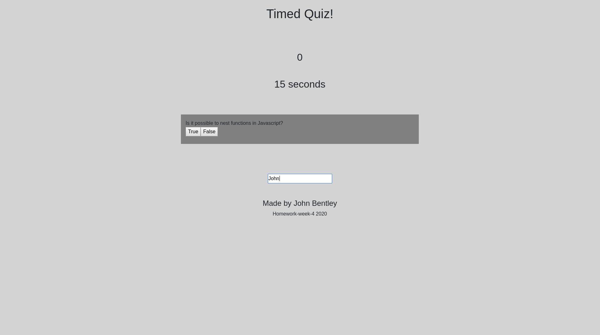

# homework-week-4
Timed Quiz

# 04 Web APIs: Code Quiz

This took a lot of time and collaboration to get this far.

The web application will scale to different screen sizes.
Type your name at the bottom and then press Start to begin the quiz.
When you get a question correct, you will gain 1 point and move to the next question.
When you get a question wrong, you will be alterted and lose 5 seconds.
If the time reaches 0, the game stops and you will need to refresh to start over.
If you complete the quiz, you can submit your score along with your name.

The following image shows a preview of the application:

